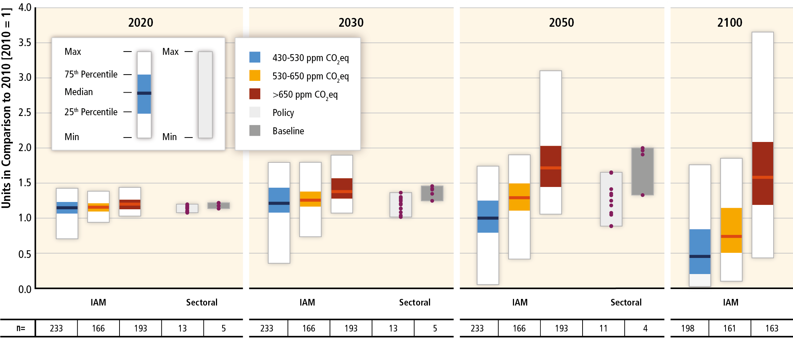
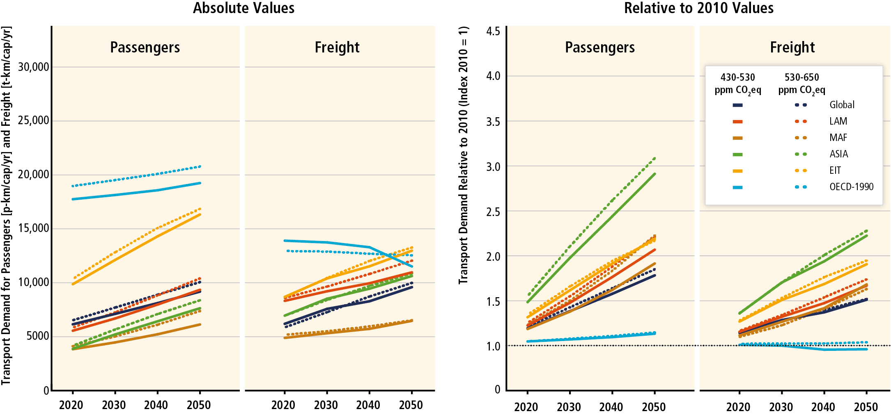
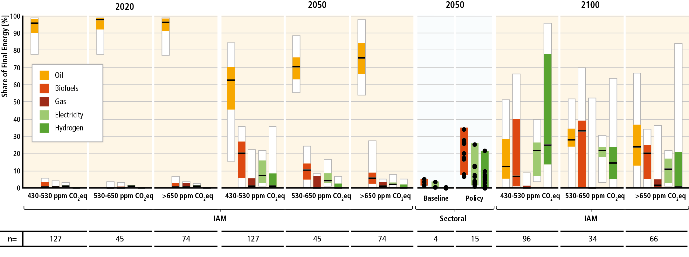

Plotting & other codes for Ch.10 “Transport” of IPCC AR6 WGIII
**************************************************************

Contents: Main figures
­— `Additional figures <#additional-figures>`__
— `Running the code <#running-the-code>`__
— `History <#history>`__
— `References <#references>`__

Main figures
============
These appear in the current draft.

========================================================================================== ===== ==========
#                                                                                          Ref   Short name
------------------------------------------------------------------------------------------ ----- ----------
`1 <#figure-1-direct-global-transport-co-emissions>`__                                     10.7  Direct global transport CO₂ emissions
`2 <#figure-2-global-passenger-and-freight-transport-activity-by-region>`__                10.8  Global passenger and freight transport activity by region
`3 <#figure-3-mode-shares-of-passenger-and-freight-transport-by-scenario-and-region>`__    10.9  Mode shares of passenger and freight transport by scenario and region
`4 <#figure-4-energy-intensity-of-transport-by-scenario>`__                                10.10 Energy intensity of transport by scenario
`5 <#figure-5-global-shares-of-final-fuel-energy-in-the-transport-sector>`__               10.11 Global shares of final fuel energy in the transport sector
========================================================================================== ===== ==========

Figure 1: Direct global transport CO₂ emissions
-----------------------------------------------

- Update of AR5 Figure 8.9. Caption was:

  Direct global transport CO₂ emissions. All results for passenger and freight transport are indexed relative to 2010 values for each scenario from integrated models grouped by CO₂-eq concentration levels by 2100, and sectoral studies grouped by baseline and policy categories. Sources: integrated models—WGIII AR5 Scenario Database (Annex II.10). Sectoral models: IAC (2008, 2011b, 2012b), WEC (2011a), EIA (2011), IEEJ (2011).

Spec
~~~~

- Ordinate: CO₂ emissions [t], normalized so that 2010 = 1.
- Abscissa:

  - Panels: 2020, 2030, 2050, and 2100.
  - Groups within panels: IAM and Sectoral.
  - Sub-groups:

    - For IAM group: 3 sub-groups of scenarios by CO₂eq concentration.
    - For Sectoral group: 2 sub-groups: baseline, policy.

- Geometry: vertical bar.

  - For IAM group: min, max, and quartiles, with interquartile range coloured and bar at the median.
  - For Scenario group: min and max, with dots for all data points.

- Additional features:

  - Horizontal strip with 'n=' showing the number of data points in each sub-group.
  - Legend.

Example
~~~~~~~

Figure 2: Global passenger and freight transport activity by region
-------------------------------------------------------------------

- Update of AR5 Figure 8.10. Caption was:

  Global passenger (p-km / capita / yr) and freight (t-km / capita / yr) regional demand projections out to 2050 based on integrated models for various CO₂-eq concentration levels by 2100—with normalized values highlighting growth and controlling differences in base year values across models. Source: […]

- But, a *modified* figure that includes demand scenarios by regions:

  - Row 1 – Region 1

    - Left side panel 1.a)

      - per capita pkm travel for Scenario 1..N
      - for 2020( current) -2030-2050-2100 with bars (min-25%- Median-75% -max)
      - (Layout as 10.5.1 for each region)

    - Right side panel 1,b)

      - per capita tkm freigth for Scenario 1..N
      - By region
      - for 2020(current) -2030-2050-2100 with bars (min-25%- Median-75% -max)
      - (Layout as 10.5.1 for each region – normalized to 2015)

  - Row N – Region M

    - Left side panel n.a)

      - per capita pkm travel for Scenario 1..N
      - for 2020(current) -2030-2050-2100 with bars (min-25%- Median-75% -max)
      - (Layout as 10.5.1 for each region)

    - Right side panel n,b)

      - per capita tkm freigth for Scenario 1..N
      - By region
      - for 2020(current) -2030-2050-2100 with bars (min-25%- Median-75% -max)
      - (Layout as 10.5.1 for each region  – normalized to 2015)

Example
~~~~~~~

Figure 3: Mode shares of passenger and freight transport by scenario and region
-------------------------------------------------------------------------------

- Layout as Figure 1 only instead of per capita passenger and freight demand we will present the % mode shares for freight and passenger transport.

Figure 4: Energy intensity of transport by scenario
---------------------------------------------------

- Update of AR5 Figure 8.11. Caption was:

  Normalized energy intensity scenarios (indexed relative to 2010 values) out to 2100 for passenger (left panel) and freight transport (centre panel), and for fuel carbon intensity based on scenarios from integrated models grouped by CO 2 eq concentration levels by 2100 (right panel). Source: […]. Note “n” equals number of scenarios assessed in each category.

Spec
~~~~

- Abscissa:

  - Panels: Passenger, Freight, Fuel Carbon Intensity
  - Groups within panels: 2020, 2030, 2050, 2100.
  - Ticks within groups: 3 sub-groups by CO₂-eq concentration.

- Ordinate:

  - Passenger panel: energy intensity of passenger-distance activity.
  - Freight panel: energy intensity of freight mass-distance activity.
  - Fuel Carbon Intensity panel: carbon intensity of total fuel energy.

- Geometry: vertical bar with min, max, and quartiles, with interquartile range coloured and bar at the median; colors by CO₂-eq concentration sub-group.

- Additional features:

  - Horizontal strip with 'n=' showing the number of data points in each sub-group.
  - Legend.

Example
~~~~~~~
.. image:: ref/11_figure_8.11.png
    :width: 50%
    :align: right
    :alt: AR5 WGIII Figure 8.11

Figure 5: Global shares of final fuel energy in the transport sector
--------------------------------------------------------------------

- Update of AR5 Figure 8.12. Caption was:

  Global shares of final fuel energy in the transport sector in 2020, 2050, and 2100 based on integrated models grouped by CO₂eq concentration levels by 2100 and compared with sectoral models (grouped by baseline and policies) in 2050. Box plots show minimum/maximum, 25th/75th percentile and median. Source: […]

Spec
~~~~

- Ordinate: % share of each fuel in total final energy used in transport.
- Abscissa:

  - Panels: 2020 (IAM), 2050 (IAM), 2050 (Sectoral), and 2100 (IAM).
  - Groups within panels:

    - For IAM panels: 3 sub-groups of scenarios by CO₂-eq concentration.
    - For Sectoral panel: 2 sub-groups of scenarios: baseline, policy.

  - Ticks within groups:

    - For IAM panels: 5 fuels: oil, biofuels, gas, electricity, hydrogen.
    - For Sectoral panel: 3 fuels: biofuels, electricity, hydrogen.

- Geometry: vertical bar.

  - For IAM group: min, max, and quartiles, with interquartile range coloured and bar at the median; colors by fuel type.
  - For Scenario group: min and max, with dots for all data points.

- Additional features:

  - Horizontal strip with 'n=' showing the number of data points in each sub-group.
  - Sectoral panel background in a different colour.
  - Legend.

Example
~~~~~~~

Additional figures
==================
These would be for author reference, annexes, or potential inclusion in the draft:

- Passenger (global, by region):
- vehicle/capita,
- Mode share
- Vehicle type share
- Schafer mode shift: historical trend and the trends for the transitions**

  - New mobility (AV-shared, AV-single occupancy)**

- EV penetration vs. policy target

  - Electrification of everything (EV, trucks, shipping, aviation)**

- NDCs (2nd order draft)**

** = Needs more heavy lifting from summaries of bottom-up models.

Running the code
================
Create a file named ``config.json`` with content like:

.. code-block:: json

   {
     "credentials": {
       "username": "your-user-name",
       "password": "your-password"
     },
     "application": "IXSE_AR6"
   }

(NB. do **not** commit this file to the git repository; your password will become a permanent part of the history, and you will need to change it.)

Then:

.. code-block::

   $ pip install -r requirements.txt

   # Show help text
   $ python main.py --help
   Usage: main.py [OPTIONS] COMMAND [ARGS]...

     Command-line interface for IPCC AR6 WGIII Ch.10 figures.

   Options:
     --help  Show this message and exit.

   Commands:
     cache      Cache data from the IIASA API in data/cache/SOURCE/.
     debug      Demo or debug code.
     plot       Plot data to output/.
     refs       Retrieve reference files listed in ref/urls.txt to ref/.
     upload     Upload outputs to Box using rclone.
     variables  Write lists of variables for each data source.

   # Run a particular command
   $ python3 main.py plot

Generating all the plots
------------------------

.. code-block::

   $ python3 main.py cache refresh AR6  # about 60 minutes
   $ python3 main.py plot --normalize

History
=======

Use ``git log`` on the command line or the “commits” tab on the GitHub website.

References
==========

These are only for convenience; the chapter/section Mendeley collections should be used to store all key references.

- `AR5 WGIII chapters & figures <https://archive.ipcc.ch/report/ar5/wg3/>`_
