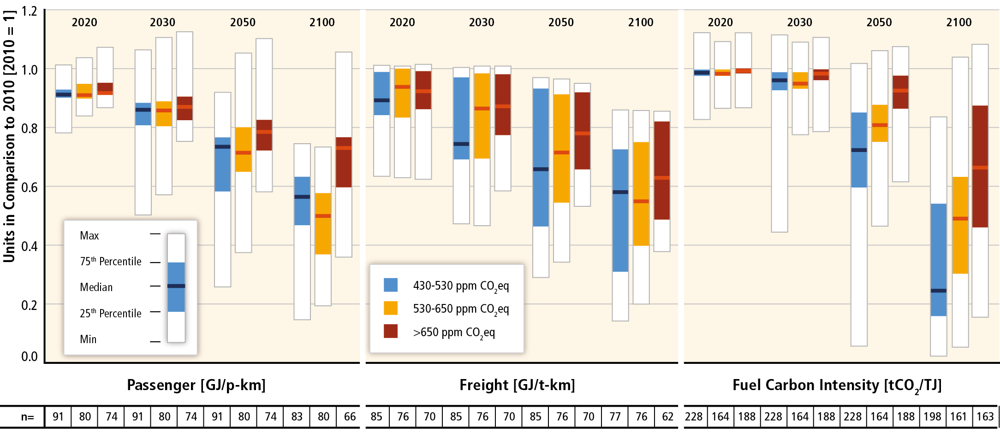

Plotting & other codes for Ch.10 “Transport” of IPCC AR6 WGIII
**************************************************************

Main figures
============
These appear in the current draft.

==== ===== ==========
#    Ref   Short name
---- ----- ----------
1    10.7  Direct global transport CO₂ emissions
2    10.8  Global passenger and freight transport activity by region
3    10.9  Mode shares of passenger and freight transport by scenario and region
4    10.10 Energy intensity of transport by scenario
5    10.11 Global shares of final fuel energy in the transport sector
==== ===== ==========

Figure 1: Direct global transport CO₂ emissions
-----------------------------------------------

- Update of AR5 Figure 8.9. Caption was:

  Direct global transport CO₂ emissions. All results for passenger and freight transport are indexed relative to 2010 values for each scenario from integrated models grouped by CO₂-eq concentration levels by 2100, and sectoral studies grouped by baseline and policy categories. Sources: integrated models—WGIII AR5 Scenario Database (Annex II.10). Sectoral models: IAC (2008, 2011b, 2012b), WEC (2011a), EIA (2011), IEEJ (2011).

Spec
~~~~

- Ordinate: CO₂ emissions [t], normalized so that 2010 = 1.
- Horizontal:

  - Panels: 2020, 2030, 2050, and 2100.
  - Groups within panels: IAM and Sectoral.
  - Sub-groups:

    - For IAM group: 3 sub-groups for scenarios
    - For Sectoral group: baseline and policy groups.

- Geometry: vertical bar.

  - For IAM group: min, max, and quartiles, with interquartile range coloured and bar at the median.
  - For Scenario group: min and max, with dots for all data points.

- Additional features:

  - Horizontal strip with 'n=' showing the number of data points in each sub-group.
  - Legend.

Example
~~~~~~~

.. image:: ref/09_figure_8.9.png
    :width: 50%
    :align: right
    :alt: AR5 WGIII Figure 8.9

Figure 2: Global passenger and freight transport activity by region
-------------------------------------------------------------------
Update of AR5 Figure 8.10.

Figure 3: Mode shares of passenger and freight transport by scenario and region
-------------------------------------------------------------------------------

- Layout as Figure 10.7 only instead of per capita passenger and freight demand we will present the % mode shares for freight and passenger transport.

Figure 4: Energy intensity of transport by scenario
---------------------------------------------------
Update of AR5 Figure 8.11.

Figure 5: Global shares of final fuel energy in the transport sector
--------------------------------------------------------------------
Update of AR5 Figure 8.12.

.. image:: ref/12_figure_8.12.png
    :width: 50%
    :align: right
    :alt: AR5 WGIII Figure 8.12

Additional figures
==================
These are for author reference, annexes, or potential inclusion in the draft.

Running the code
================

.. code-block::

   $ pip install -r requirements.txt
   $ python figures.py

History
=======
Use `git log` on the command line or the `commits` tab on the GitHub website.
